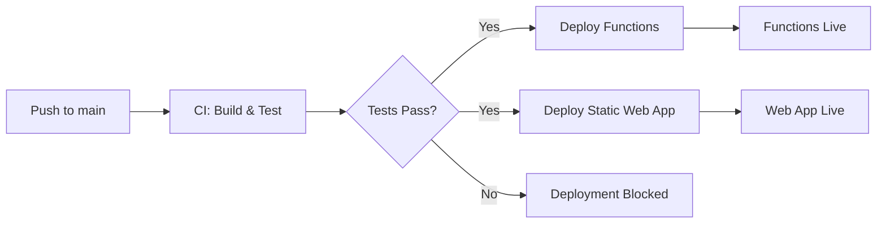

# GitHub CI/CD Pipeline Setup

## ✅ Configuration Complete

All GitHub Actions workflows are configured and ready for automatic deployment to Azure!

---

## 📋 Workflows Overview

### 1. CI - Build and Test (`ci.yml`)
**Triggers:** Push or PR to `main` or `develop` branches

**What it does:**
- ✅ Builds entire .NET solution (.NET 8)
- ✅ Installs npm dependencies
- ✅ Builds Tailwind CSS
- ✅ Publishes artifacts for deployment
- ✅ Runs on every push/PR for quality checks

**Status:** ✅ Active

---

### 2. Deploy Azure Functions (`deploy-functions.yml`)
**Triggers:**
- After successful CI build on `main` branch
- Manual trigger via GitHub Actions UI

**What it does:**
- ✅ Builds GrantMatcher.Functions project
- ✅ Deploys to `func-grantmatcher-dev.azurewebsites.net`
- ✅ Optionally seeds grants database (manual trigger only)

**Azure Resource:** `func-grantmatcher-dev`
**Status:** ✅ Active

---

### 3. Deploy Static Web App (`deploy-static-web-app.yml`)
**Triggers:**
- Push to `main` branch (paths: `src/GrantMatcher.Client/**`)
- Pull Request to `main` branch
- Manual trigger

**What it does:**
- ✅ Installs npm dependencies
- ✅ Builds Tailwind CSS
- ✅ Publishes Blazor WebAssembly app
- ✅ Deploys to Static Web App

**Azure Resource:** `swa-grantmatcher-dev`
**URL:** https://salmon-ocean-0a660780f.1.azurestaticapps.net
**Status:** ✅ Active

---

## 🔐 GitHub Secrets Configured

All necessary secrets have been added to the repository:

| Secret Name | Purpose | Status |
|------------|---------|--------|
| `AZURE_FUNCTIONAPP_PUBLISH_PROFILE` | Azure Functions deployment credentials | ✅ Set |
| `AZURE_STATIC_WEB_APPS_API_TOKEN` | Static Web App deployment token | ✅ Set |
| `FUNCTION_APP_KEY` | Function App authorization key (for seeding) | ✅ Set |

**Verify secrets:** https://github.com/iunknown21/GrantMatcher/settings/secrets/actions

---

## 🚀 Deployment Flow

### Automatic Deployment (Main Branch)



**Steps:**
1. Developer pushes code to `main` branch
2. **CI workflow** runs: Build → Test → Publish artifacts
3. If CI succeeds:
   - **Functions workflow** deploys to Azure Functions
   - **Static Web App workflow** deploys Blazor client
4. Both deployments complete independently
5. Application is live!

### Manual Deployment

**Option 1: GitHub Actions UI**
1. Go to https://github.com/iunknown21/GrantMatcher/actions
2. Select workflow (Functions or Static Web App)
3. Click "Run workflow" → Select branch → Run

**Option 2: Command Line**
```bash
# Trigger Functions deployment
gh workflow run "Deploy Azure Functions" --ref main

# Trigger Static Web App deployment
gh workflow run "Deploy Static Web App" --ref main
```

---

## 📊 Monitoring Deployments

### GitHub Actions Dashboard
https://github.com/iunknown21/GrantMatcher/actions

**View:**
- ✅ Deployment status (success/failure)
- ⏱️ Build duration
- 📝 Detailed logs for each step
- 🔄 Deployment history

### Azure Portal

**Functions App:**
- URL: https://portal.azure.com/#resource/subscriptions/f6bd721d-0b4f-4fbd-94cf-4719f6e3888f/resourceGroups/rg-grantmatcher-dev/providers/Microsoft.Web/sites/func-grantmatcher-dev
- Monitor: Deployment Center, Logs, Metrics

**Static Web App:**
- URL: https://portal.azure.com/#resource/subscriptions/f6bd721d-0b4f-4fbd-94cf-4719f6e3888f/resourceGroups/rg-grantmatcher-dev/providers/Microsoft.Web/staticSites/swa-grantmatcher-dev
- Monitor: Deployments, Build history, Environment

---

## 🛠️ Common Tasks

### Deploy to Production

**Current Setup:** Deployments go to `Development` environment

**To add Production:**

1. Create production Azure resources:
```bash
# Create production resource group
az group create --name rg-grantmatcher-prod --location eastus

# Create production Function App
az functionapp create \
  --name func-grantmatcher-prod \
  --resource-group rg-grantmatcher-prod \
  --storage-account <prod-storage> \
  --consumption-plan-location eastus \
  --runtime dotnet-isolated \
  --runtime-version 8 \
  --functions-version 4
```

2. Update workflows to include production environment
3. Add production secrets to GitHub
4. Optionally: Add manual approval for production deployments

### Rollback a Deployment

**Functions:**
```bash
# Via Azure CLI
az functionapp deployment list --name func-grantmatcher-dev \
  --resource-group rg-grantmatcher-dev

# Swap to previous slot (if slots configured)
az functionapp deployment slot swap \
  --name func-grantmatcher-dev \
  --resource-group rg-grantmatcher-dev \
  --slot staging --target-slot production
```

**Static Web App:**
- Go to Azure Portal → Static Web App → Deployments
- Select previous successful deployment
- Click "Redeploy"

### Seed Grants Database

**Manual seeding via GitHub Actions:**
1. Go to https://github.com/iunknown21/GrantMatcher/actions
2. Click "Deploy Azure Functions"
3. Click "Run workflow"
4. Select `main` branch
5. Click "Run workflow"

This triggers the seeding endpoint after deployment completes.

**Or via API:**
```bash
curl -X POST \
  https://func-grantmatcher-dev.azurewebsites.net/api/admin/grants/seed \
  -H "x-functions-key: <YOUR_FUNCTION_KEY>"
```

---

## 🐛 Troubleshooting

### Deployment Failed

**Check logs:**
```bash
# View GitHub Actions logs
gh run list
gh run view <run-id>

# View Azure logs
az functionapp log tail \
  --name func-grantmatcher-dev \
  --resource-group rg-grantmatcher-dev
```

**Common issues:**

1. **Build errors:** Check CI workflow logs for compilation errors
2. **Publish profile expired:** Regenerate and update secret
3. **Static Web App token invalid:** Get new token from Azure Portal
4. **Functions deployment timeout:** Check Application Insights for startup errors

### CI Build Fails

**Common causes:**
- Missing NuGet packages → Check `.csproj` files
- npm dependencies issue → Delete `node_modules` and `package-lock.json`, rebuild
- Tailwind CSS build error → Check `tailwind.config.js` configuration
- .NET version mismatch → Ensure using .NET 8.0

**Fix workflow:**
1. Fix code locally
2. Test build: `dotnet build`
3. Push fix to `main`
4. CI will automatically retry

### Static Web App Not Updating

**Check:**
1. Deployment succeeded in GitHub Actions?
2. Build output correct? (should be in `wwwroot`)
3. Cache issue? Hard refresh browser (Ctrl+Shift+R)
4. Check Azure Portal → Static Web App → Deployments for status

**Force rebuild:**
```bash
gh workflow run "Deploy Static Web App" --ref main
```

---

## 📈 Advanced Configuration

### Add Staging Environment

Update workflows to deploy to staging first:

```yaml
# In deploy-functions.yml
jobs:
  deploy-staging:
    # ... deploy to staging slot

  deploy-production:
    needs: deploy-staging
    environment:
      name: 'Production'
      url: ${{ steps.deploy.outputs.webapp-url }}
    # ... deploy to production
```

### Add Automated Tests

Uncomment in `ci.yml`:
```yaml
- name: Run tests
  run: dotnet test --configuration Release --no-build --verbosity normal
```

### Add Environment Variables

**Per environment in Azure:**
```bash
az functionapp config appsettings set \
  --name func-grantmatcher-dev \
  --resource-group rg-grantmatcher-dev \
  --settings "ENVIRONMENT=Development"
```

**In GitHub workflow:**
```yaml
env:
  ASPNETCORE_ENVIRONMENT: Development
```

### Deployment Notifications

Add to workflows:
```yaml
- name: Notify Slack
  if: failure()
  uses: 8398a7/action-slack@v3
  with:
    status: ${{ job.status }}
    webhook_url: ${{ secrets.SLACK_WEBHOOK }}
```

---

## 📚 References

- **GitHub Actions Docs:** https://docs.github.com/actions
- **Azure Functions Deployment:** https://learn.microsoft.com/azure/azure-functions/functions-how-to-github-actions
- **Static Web Apps Deployment:** https://learn.microsoft.com/azure/static-web-apps/github-actions-workflow
- **Workflow Syntax:** https://docs.github.com/actions/using-workflows/workflow-syntax-for-github-actions

---

## ✅ Checklist

- [x] CI workflow configured for build and test
- [x] Functions deployment workflow configured
- [x] Static Web App deployment workflow configured
- [x] All GitHub secrets added
- [x] Workflows updated for GrantMatcher resource names
- [x] .NET version set to 8.0
- [x] Automatic deployment on push to main
- [x] Manual deployment option available
- [x] Grant seeding workflow included
- [ ] Add automated tests (when tests are written)
- [ ] Add production environment (when needed)
- [ ] Configure deployment approvals (optional)
- [ ] Set up monitoring alerts (optional)

---

**Status:** ✅ **CI/CD Pipeline Active and Ready!**

Push to `main` branch will automatically deploy to Azure. Monitor at https://github.com/iunknown21/GrantMatcher/actions 🚀
